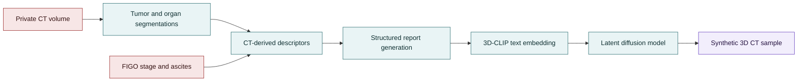

<p align="center">
  <br>
  <b>OvESyn</b>
  <br>
  <sub>Evidence-Based Text-Conditioned 3D CT Synthesis for Ovarian Cancer</sub>
  <br><br>
  <a href="#overview"></a>
  <a href="#privacy-and-data"></a>
  <a href="#quick-start"></a>
  <a href="#citation"></a>
</p>

---

## Overview

OvESyn (Ovarian Evidence-based Synthesis) is a research codebase for
text-conditioned 3D CT synthesis in report-scarce ovarian cancer imaging.
Instead of relying on original radiology reports, OvESyn constructs structured
Findings and Impression text from:

- CT-derived lesion descriptors from tumor masks
- organ-contact descriptors from anatomical segmentations
- two routine clinical variables: FIGO stage and ascites status

The generated report is encoded by a 3D vision-language model and used to
condition a latent diffusion generator for volumetric CT synthesis.

This repository is a public, privacy-preserving release of the method code. It
does not contain clinical scans, patient-level metadata, generated patient
reports, trained institutional checkpoints, run logs, or paper figures derived
from private cases.



## Repository Layout

```text
OvESyn/
  prompt_generation/          Structured report generation from private descriptors
  scripts/                    CLIP adaptation, diffusion training, inference, evaluation
  configs/                    Sanitized architecture and run configuration templates
  examples/                   Synthetic examples of expected input schemas
  docs/                       Data policy, input formats, and release checklist
  core/                       Lightweight configuration and registry utilities
```

## What Is Included

| Area | Included |
| --- | --- |
| Report generation | Prompt templates and code for Findings/Impression construction |
| CLIP adaptation | Full fine-tuning and LoRA configuration paths |
| Generation | Latent diffusion training and inference scripts |
| Evaluation | Distributional, semantic, radiomics, and visualization utilities |
| Examples | Synthetic schema examples only, with fake IDs and fake values |
| Documentation | Data availability, input formats, and release checklist |

## What Is Not Included

| Excluded item | Reason |
| --- | --- |
| CT volumes, masks, and NIfTI files | Private clinical data |
| Patient-level CSV/JSON split files | Potentially linkable derived data |
| Generated patient reports | Derived from private imaging descriptors |
| Checkpoints and embeddings | May encode institutional data and are large |
| Run logs, manifests, and paper figures | May expose paths, IDs, or case-specific outputs |

## Quick Start

Create an environment:

```bash
conda create -n ovesyn python=3.10
conda activate ovesyn
pip install -r requirements.txt
```

Optional packages used by specific stages:

```bash
pip install pyradiomics vllm totalsegmentator scikit-learn matplotlib seaborn
```

Run a small report-generation preview on your own private metadata:

```bash
python prompt_generation/generate_captions_local_v4.py \
  --metadata_csv /path/to/private/metadata.csv \
  --out_dir outputs/reports_preview \
  --train_json /path/to/private/train.json \
  --val_json /path/to/private/val.json \
  --test_json /path/to/private/test.json \
  --max_patients 5
```

Convert generated reports to the CLIP training schema:

```bash
python prompt_generation/make_clip_reports_from_final.py \
  --input_csv outputs/reports_preview/patient_reports.csv \
  --output_csv outputs/reports_preview/reports.csv
```

## Private Input Contract

OvESyn expects users to provide their own institutional data locally. The
public repository only documents the schema.

Required private assets:

- preprocessed CT volumes
- tumor masks with lesion labels
- organ segmentations
- split JSON files for train/validation/test
- clinical metadata containing FIGO stage and ascites status
- pretrained public or locally authorized model checkpoints

See [docs/INPUT_FORMATS.md](docs/INPUT_FORMATS.md) for synthetic examples of
the metadata and split schemas.

## Training And Inference

Sanitized configuration templates are provided under `configs/templates/`.
Copy them outside version control or into a private experiment directory before
filling in local paths:

```bash
cp configs/templates/unet_train_env.example.json private_configs/unet_train_env.json
cp configs/templates/clip_lora_promptgen_v6.example.yaml private_configs/clip_lora.yaml
```

Then replace placeholders such as:

- `/path/to/private_ct`
- `/path/to/private_reports.csv`
- `/path/to/authorized_checkpoint.pt`

The original paper experiments used a private HGSOC cohort and therefore cannot
be reproduced from this repository alone. The code is intended to reproduce the
method on appropriately governed local data.

## Privacy And Data

This release follows a conservative no-disclosure policy:

- no clinical data
- no patient IDs
- no patient-level measurements
- no generated patient-specific reports
- no learned institutional checkpoints
- no output figures derived from private cases

Before making any fork public, run the checklist in
[docs/RELEASE_CHECKLIST.md](docs/RELEASE_CHECKLIST.md).

## Data And Model Availability

The private institutional cohort used in the manuscript cannot be released due
to patient privacy, consent, and institutional governance constraints. Public
code is provided to support method inspection and reuse on governed local data.

See [docs/DATA_AND_MODEL_AVAILABILITY.md](docs/DATA_AND_MODEL_AVAILABILITY.md)
for the suggested manuscript statement.

## Citation

If you use this code, please cite the associated manuscript:

```bibtex
@article{panaccione2026ovesyn,
  title   = {Evidence-Based Text-Conditioned 3D CT Synthesis for Ovarian Cancer},
  author  = {Panaccione, Francesca Pia and Lomurno, Eugenio and Fati, Francesca and others},
  journal = {Computerized Medical Imaging and Graphics},
  year    = {2026},
  note    = {Under review}
}
```

## License

The final code license should be selected before public release. Third-party
components and pretrained checkpoints retain their original licenses and usage
terms.
